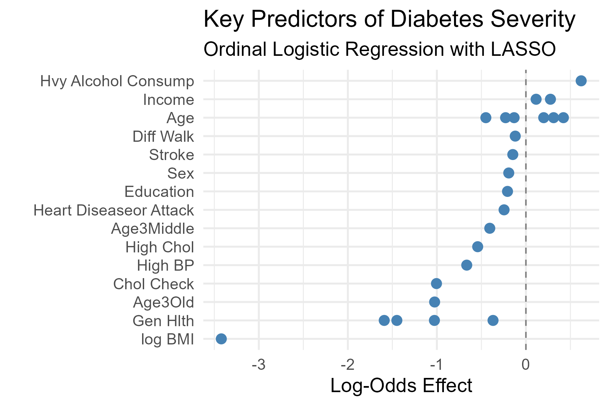
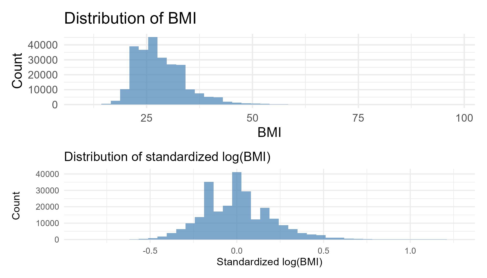
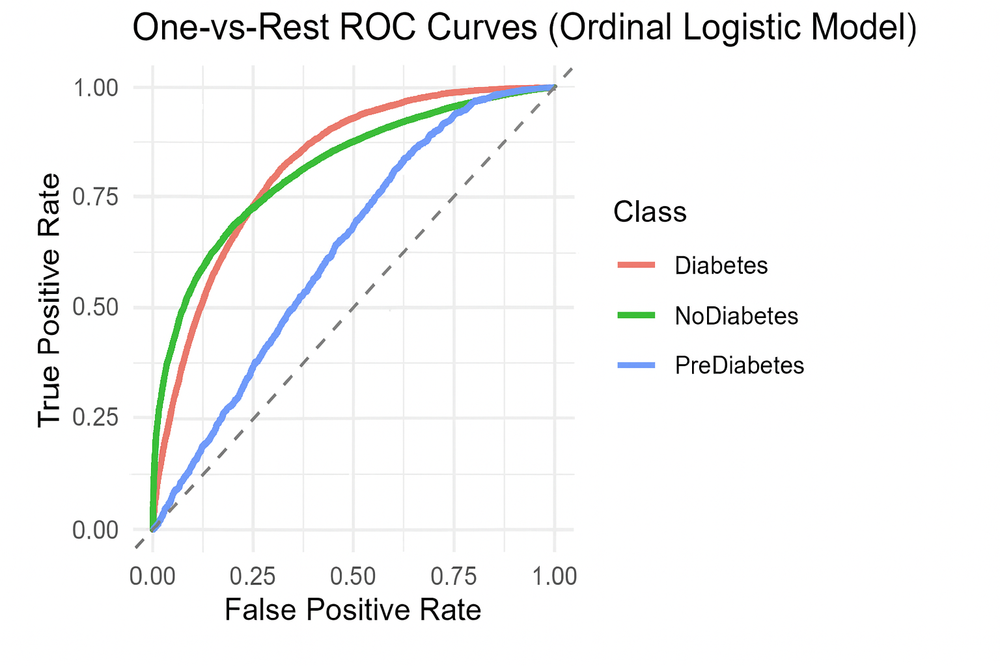

# Introduction

Diabetes remains one of the most prevalent chronic diseases in the United States, affecting over 38 million Americans, or roughly one in ten people. Type 2 diabetes accounts for the majority of cases, and tens of millions more have prediabetes, a condition characterized by elevated blood sugar and an increased risk of developing diabetes. While several contributing factors of diabetes and prediabetes are well established, including obesity, high blood pressure, and poor diet, the complex interactions among these and other health indicators are still an active area of research. Understanding these relationships is critical to identifying high-risk populations and informing public health interventions.

Motivated by this context, the present case study focuses on analyzing [data](https://www.kaggle.com/datasets/alexteboul/diabetes-health-indicators-dataset) from the 2015 CDC Behavioral Risk Factor Surveillance System (BRFSS). The BRFSS is a large-scale annual telephone survey of approximately 400,000 Americans that collects detailed information on health-related behaviors, chronic health conditions, and use of preventive services. This dataset provides a rich source of information for examining potential predictors of diabetes and prediabetes at the population level.

The primary goal of this project is to develop predictive models that estimate an individual’s risk of diabetes using a subset of survey responses. Specifically, we aim to answer the following research questions:

1.  Can survey responses from the BRFSS accurately predict whether an individual has diabetes?
2.  Which health indicators and behaviors are the most predictive of diabetes risk?
3.  Can a reduced set of features provide reliable predictions, enabling the creation of a short-form screening tool?

While our data is from 2015, understanding the relationships between different health indicators and the risk of prediabetes and diabetes can help inform public health officials, healthcare providers, and researchers. Strikingly, 1 in 5 diabetics and 8 in 10 prediabetics are not aware of their risk today. The only way to truly diagnose prediabetes or diabetes are through testing glucose levels, so our research focuses instead on helping identify high-risk populations, guiding doctor-patient conversations, and better informing the public about early-intervention strategies rather than replacing current diagnosis tools.

To achieve these goals, we combine exploratory data analysis (EDA), feature selection, and predictive modeling. The analysis starts with an examination of the distributions of key health indicators and their associations with diabetes status, followed by an assessment of useful interaction effects and variable transformations. We then train and evaluate cumulative logistic regression models using an 80/20 train-test split. Model selection was then performed based on threshold-independent metrics such as BIC, quadratic weighted kappa, log loss, mean absolute error, and macro AUC. Once the best model is chosen, threshold-dependent metrics such as One-vs-All (OvA) ROC, F1, precision, and recall were used to determine an optimal probability cutoff. This framework provides insights into the most predictive health indicators and supports both clinical practice and public health applications.

# Methodology

```{r message=FALSE, warning=FALSE, echo=FALSE}
library(tidyverse)
library(patchwork)
library(bookdown)
library(knitr)
source("./eval.R")
source("./cleandata.R")
source("./partition.R")
source("./confusionmatrix.R")
source("./plots.R")

diabetes_raw <- read.csv("data/diabetes_012_health_indicators_BRFSS2015.csv")
diabetes <- cleandata(diabetes_raw)
```

## Data Description

The dataset used in this analysis contains 253,680 survey responses with 21 health-related features. These features represent participants’ answers to behavioral and medical questions, along with derived indicators of overall health status. Most binary variables follow a consistent coding scheme in which 1 indicates “yes” and 0 indicates “no.” Similarly, the variable Sex is encoded with 0 representing male and 1 representing female.

Several originally numeric variables were pre-categorized into ordered groups. For instance, Age is represented as a 13-level categorical variable, where 1 corresponds to ages 18–24, 9 corresponds to ages 60–64, and 13 represents age 80 or older. Similar ordered categories also appear in variables related to income, physical health, and mental health.

The target variable, Diabetes_012, is an ordered factor capturing three diabetes-related outcomes: 0 for non-diabetes, 1 for prediabetes, and 2 for diabetes. Most individuals classified as diabetic fall into the Type 2 diabetes category, which is consistent with broader population trends.

## Data Preparation

Minimal data cleaning was performed to ensure proper variable types. Only the variables `BMI`, `MentHlth`, and `PhysHlth` were treated as numeric, while all other variables were converted to factors. The target variable `Diabetes_012` was encoded as an ordered factor to reflect the severity of disease.

The data were split into training and testing sets using an 80-20 split. Exploratory data analysis on the training set revealed that the classes were heavily imbalanced, with prediabetes being underrepresented (see the table below).

| Diabetes Risk | Count  |
|---------------|--------|
| No Diabetes   | 213703 |
| PreDiabetes   | 4631   |
| Diabetes      | 35346  |

This helped identify the need for data balancing as there were far more non-diabetes and diabetes case observations compared to prediabetes ones. To address this, downsampling of the majority classes was applied to improve model performance while keeping computation manageable.

## Exploratory Data Analysis

We examined the distributions of categorical variables and visualized the proportion of each `Diabetes_012` category across levels of the features (see Figure 1). This helped identify variables with strong associations with diabetes status.

```{r fig.cap = "Distribution of Categorical Variables by Diabetes Risk", message=FALSE, warning=FALSE, echo=FALSE, fig.height=4, fig.width=8}
distribution_plot()
```

Additionally, continuous variables such as `BMI`, `MentHlth`, and `PhysHlth` were visualized using histograms to assess their distributions and potential need for transformations. Interaction effects and transformations of variables were also explored to capture non-linear relationships that may improve model performance.

After building intuition for the underlying feature distributions, our group experimented with various model types, transformations, and predictors to get best predictive accuracy.

## Feature Selection

The cleaned data set includes 21 feature variables. Many of these variables are highly correlated (eg. fruit consumption vs vegetable consumption), which can lead to multicollinearity. Hence, we first performed Ordinal Lasso Regression. We chose Lasso over Ridge regression because the coefficients of many of the feature variables were already extremely low/close to zero in our baseline model. Thus, by allowing the coefficients to actually go to zero, Lasso allowed us to make clearer choices on which features to select.

::: {#fig-lasso-coefs}
{width="50%"}
:::

We also noted which coefficients had a sign change in order to see what direct coefficients of certain features were heading towards. Using the selected features, we were still left with 15 medically intuitive candidate features. To further reduce our feature space, we performed stepwise selection criteria using BIC. We used BIC as our criteria because it penalizes larger feature models a lot more than other criteria (eg. AIC), hence resulting in a smaller feature set. The final feature set includes:

\textit{BMI, Age, HighBP,  HighChol, Smoker, Stroke, HeartDiseaseorAttack, HvyAlcoholConsump, AnyHealthcare, NoDocbcCost, GenHlth, DiffWalk, Sex, Income}

## Interaction Effects

Within the chosen set of features, there could be a case made for many interaction terms to exist. For example, smoking directly causes higher blood pressure and cholesterol. Hence, these three variables should have interactions with each other. However, after looking at all subsets of models with different interaction terms, there was only one statistically significant interaction term which improved the model's prediction accuracy: \textit{High Cholesterol * High Blood Pressure}.

From the case's perspective, this medically makes sense: higher cholesterol can lead to a build up of plaque in the arteries which directly leads to higher blood pressure.

## Transformations

Based on the features selected in the previous section, we decided to focus on discovering transformations that would improve the predictive power of the model. After investigating the distributions of each variable and various interaction terms, two transformations were ultimately added to the final model.

After performing downsampling to balance the data, we transformed the BMI predictor by applying a logarithmic transformation and then standardizing the variable. This was done because the original BMI distribution was right-skewed (see Figure 3), both before and after randomized downsampling. However, after the aforementioned transformations, the data became a lot more normalized which led to a significant increase in the final model's predictive power.

::: {#fig-new-bmi-hist}
{width="80%"}
:::

Furthermore, the age feature was also transformed. In our baseline model, we noticed that each level of age had a weak p-value associated with it. Due to this, we collapsed age from 13 ordinal categories down to just three. The p-values associated with each value made the coefficients statistically significant and helped increase the model's overall predictive accuracy. We experimented collapsing other features that had numerous categories, however, none of them yielded an improvement on the model's accuracy.

## Thresholding

Additionally, the method by which we measured accuracy was not based solely on overall predictive accuracy. Instead, we optimized the model’s classification thresholds to prioritize minimizing false negatives rather than false positives, since misdiagnosing a patient who actually has diabetes is more costly.

To evaluate classification performance in a threshold-dependent manner, we adopted a one-vs-rest framework. For each class, predicted probabilities were treated as binary scores by comparing the probability of belonging to that class against the probabilities of all other classes combined. This allowed us to construct ROC curves for each outcome category independently, despite the underlying ordinal structure of the model. The resulting curves in Figure 4 illustrate the trade-off between true positive rate (sensitivity) and false positive rate across all possible probability thresholds.

Figure 4 presents one-vs-rest (OvR) ROC curves derived from the fitted cumulative logistic (ordinal) regression model. Because the outcome variable is ordinal with three ordered categories (No Diabetes, Pre-Diabetes, and Diabetes), the model was first fit using cumulative logit link functions, which estimate category probabilities through a series of monotonic cutpoints. Importantly, no thresholding decisions were made during model fitting. Instead, threshold selection was performed after the model has been trained and class probabilities have been estimated.

::: {#fig-roc-curves}
{width="70%"}
:::

Once the final model was selected, threshold-dependent metrics (including one-vs-all ROC curves, precision, recall, and F1 score) were used to identify an operating point that aligned with our research objective. In this study, we optimized the model’s classification thresholds to prioritize minimizing false negatives rather than false positives, since misdiagnosing a patient who actually has diabetes is more costly than incorrectly flagging a healthy patient. Consequently, probability cutoffs were selected to favor higher sensitivity, even at the expense of increased false positives.

## Modeling Approach

To account for the ordinal nature of the response, `Diabetes_012`, we used cumulative logistic regression, also known as a cumulative logit model. This approach models the ordered progression from non-diabetes to prediabetes to diabetes by estimating cumulative probabilities rather than modeling each class independently. Specifically, the model defines cumulative probabilities $\pi_j(x) = P(Y \le j| x)$, which represent the probability that an individual’s diabetes status falls at or below category j given covariates x. Category-specific probabilities are then obtained as differences between successive cumulative probabilities. Unlike baseline-category multinomial logistic regression, cumulative logit models do not require the selection of a reference outcome class. Instead, the model estimates category-specific intercepts, or cutpoints, that serve as baselines along an underlying ordinal disease severity scale, while assuming that predictor effects remain constant across thresholds.

Our final model incorporates transformations of key continuous predictors to better capture nonlinear relationships, as well as an interaction effect between high blood pressure and high cholesterol. The final cumulative logistic regression model is given by:

polr(Diabetes_012 \~ log_centered(BMI) + Age_3 + HighBP, + HighChol + Smoker + Stroke + HeartDiseaseorAttack + HvyAlcoholConsump + AnyHealthcare + NoDocbcCost + GenHlth + DiffWalk + Sex + Income + HighBP\*HighChol)

This modeling framework balances predictive performance with interpretability, making it well suited for understanding how health behaviors and indicators jointly influence diabetes risk across different levels of severity.

# Results

## Model Assumptions

By using a cumulative logit model, we assume proportional odds. To verify this, we used the Brant test, which indicated that the proportional odds assumption was largely met (Omnibus $\gamma^2(29) = 215.44$, $p < 0.001$). Only a few predictors (notably HighChol, HvyAlcoholConsump, NoDocbcCost, and high-income categories) exhibited minor deviations $p < 0.05$. Given the small number and effect size of deviations, the assumption was considered adequately satisfied.

## Prediction

```{r fig.cap = "Cumulative Logit Model Confusion Matrix", message=FALSE, warning=FALSE, echo=FALSE, fig.height=2.2, fig.width=5, fig.pos='!H'}
results_plot()
```

The model shows an overall sensitivity of about 0.50 and a specificity of about 0.81 across classes, indicating it is more effective at correctly identifying negatives than positives. It is highly specific for nodiabetes (93%), meaning few false positives, but sensitivity is moderate (48%), so many true nodiabetes cases are upgraded to prediabetes or diabetes. For prediabetes, both sensitivity (29%) and specificity (75%) are low, showing the model struggles to detect this class accurately. For diabetes, sensitivity is relatively strong at 74% (the model correctly identifies most diabetic cases) but specificity (74%) is moderate, suggesting a fair number of false positives.

These results are far from perfect but are extremely encouraging. Importantly, false negatives (predicting NoDiabetes when an individual actually has diabetes) are rare, indicating strong performance in distinguishing the most severe category. The model tends to err conservatively by predicting higher‑risk categories (prediabetes or diabetes) rather than underestimating risk, which we believe is beneficial from a public health perspective, as it identifies individuals potentially “trending” toward diabetes.

As discussed later, we explored several other models to improve predictive power but achieved only minimal gains, reinforcing our emphasis on interpretability over predictive performance. We cannot be fully accurate by just using survey results to predict a medical condition that requires testing, but we can identify important risk factors.

## Interpretation

The main benefit of our cumulative logit models is interpretability: we are able to reconstruct the predicted probability of diabetes risk as different predictors change, which is immensely valuable to identify the main sources of risk for diabetes. Since we have 11 predictors, it's difficult to visualize each effect individually, so we set baselines of "healthy" or "unhealthy" individuals and vary one or two variables at a time.

```{r fig.cap = "Probability of Diabetes Risk Across Age and BMI", message=FALSE, warning=FALSE, echo=FALSE, fig.height=2.3, fig.width=8, fig.pos='H', out.width='90%', fig.align='center'}

age_plot()
```

Above, we take the baseline of an unhealthy individual (someone with high cholesterol who doesn't exercise much) and plot our model's predicted probability of diabetes risk against the individual's BMI and age group. Strikingly, the distribution shifts left as age increases, showing that older individuals are more at risk of diabetes than a younger one of the same BMI.

```{r fig.cap = "Probability of Diabetes Risk Across Sex and BMI", message=FALSE, warning=FALSE, echo=FALSE, fig.height=2.5, fig.width=6, fig.pos='H', out.width='80%', fig.align='center'}
sex_plot()
```

As seen above, some predictors aren't as interactive. For instance, the probability distributions look generally the same for males and females of similar health status. Our model then indicates that a female individual generally has about the same risk as a male individual with an equivalent BMI. However, this does not mean that sex is a poor predictor, but rather that it contributes to more substantial variation in other predictive factors.

While these plots highlight how age, sex, and BMI interact to shape the probability of diabetes risk, they only show a subset of the predictors in the model. To better understand which factors contribute most strongly to diabetes severity overall, we next examine the adjusted odds ratios from the cumulative logit model.

Figure 8 presents adjusted odds ratios from the final cumulative logit model, with 95% confidence intervals on a logarithmic scale. Each point shows how a given predictor’s coefficient is associated with higher levels of diabetes severity while holding other variables constant. Points to the right of the 1.0 threshold indicate greater odds of more severe diabetes, while those to the left indicate lower odds. Predictors shown in blue are statistically significant at the 5% level, while the red points are not.

```{r fig.cap= "Odds Ratios from the Final Cumulative Logit Model", message=FALSE, warning=FALSE, echo=FALSE, fig.height=4.5, fig.width=8, fig.pos='H', out.width='90%', fig.align='center'}

coef_plot(model_polr)
```

Overall, self-reported general health shows the strongest association with diabetes status. Respondents who rated their health as fair or poor have substantially higher odds of being diabetic compared to those reporting excellent health. Age and BMI also have strong positive coefficients, meaning that older adults and individuals with higher body mass index are much more likely to fall into more severe diabetes categories. High blood pressure and high cholesterol are also significant predictors, both increasing the odds of diabetes, which is consistent with well-known metabolic and cardiovascular risk patterns.

Some variables show weaker or nonsignificant effects once other factors are controlled for. For example, smoking status, sex, and healthcare coverage have odds ratios close to one, suggesting smaller independent associations. However, these coefficients are still valuable because they may improve the model’s overall predictive performance and help account for shared variability among correlated health and socioeconomic factors. The interaction between high blood pressure and high cholesterol exhibits a small but meaningful increase in odds, indicating that these conditions jointly elevate risk beyond their individual effects. In contrast, heavy alcohol consumption appears slightly protective, which may reflect residual confounding rather than a true clinical relationship.

## Short-Form Screening Tool

In our project, we aimed to identify the factors associated with diabetes and narrow down the dataset we used into a short-form screening tool to quickly and effectively identify those at risk. The original survey from the CDC contained 330 features, which were reduced to 21 cleaned features in the dataset. Our survey developed from our final model now only includes 11 questions.

-   **Traits** (Sex and Age). Immutable factors that can influence diabetes but that cannot be changed. As seen with our analysis on age, these are heavily influential but act as informing variables rather than something that can be changed.

-   **Health History** (BMI, Stroke History, Heart Disease History, Difficulty Walking Up Stairs). This category captures important aspects of a person’s existing health status and physical condition - factors that directly contribute to their risk of developing diabetes or complications associated with it.

-   **Habits** (Smoking, Alcohol Consumption). These variables track history with habits known to deteriorate health, and can help inform lifestyle changes for the concerned individual.

-   **Economic Status** (Health Care Coverage, Refusal of Treatment Due to Cost, Income Level). Our study has revealed an unfortunate truth about diabetes risk as well: likely due to early signs morphing into diabetes in the absence of proper treatment. This observation should spur change amongst policymakers such that cost is not prohibitive to proper diabetes care.

By focusing on immutable traits, health history, habits, and economic factors, the final model provides a balanced assessment of diabetes risk while remaining practical for real-world application. This simplified, 11-question survey can aid early identification and prevention efforts, guiding both individuals and healthcare providers toward timely interventions and encouraging broader public health and policy actions to reduce diabetes incidence.

# Aside: Black Box Models

While our main focus was to develop a model on a subset of predictors that allowed for interpretation of the driving factors of diabetes risk, we also considered several "black box" models that focused on predictive power rather than inference. These models lose the interpretability of our cumulative logit model but offer systems that allow for more abstract boundaries to be drawn between our classes.

-   **Support Vector Machine (SVM).** A classification algorithm that finds the optimal boundary that best separates data points of different classes in a high-dimensional space. While SVMs are effective with linear boundaries, we also used a radial basis function (RBF) kernel to capture more complex, nonlinear relationships, with the cost and gamma parameters tuned via cross-validation.

-   **Random Forests.** An ensemble method that builds many decision trees on random subsets of data and features, and combines their results to improve accuracy and reduce overfitting. We tried both regular random forests and an adapted version for ordinal data presented in Hornung (2020).

-   **Boosted Trees.** A sequential ensemble technique where each new tree is trained to correct the errors of the previous ones, producing a strong overall model through weighted combinations of weak learners. Hyperparameters like number of trees and max depth were also tuned via cross-validation.

We used three metrics to evaluate each of these approaches against each other:

-   Accuracy: The proportion of correct predictions out of total cases. It reflects overall classification performance but doesn’t account for the ordinal nature of the outcome.

-   Quadratic Weighted Kappa: Measures agreement between predicted and actual classes, weighting disagreements by their distance along the ordinal scale. Higher values indicate better ordinal consistency.

-   Mean Absolute Error: The average absolute difference between predicted and actual class labels. Lower values indicate predictions closer to the correct category, emphasizing ordinal proximity rather than just exact matches.

| model            | ACC    | QWK    | MAE    |
|------------------|--------|--------|--------|
| Cumulative Logit | 0.61   | 0.35\* | 0.58   |
| Linear SVM       | 0.62   | 0.32   | 0.56   |
| Radial SVM       | 0.63\* | 0.32   | 0.56   |
| Random Forest    | 0.60   | 0.32   | 0.55\* |
| Ordinal Forest   | 0.61   | 0.31   | 0.56   |
| Boosted Trees    | 0.33   | 0.25   | 0.96   |

Overall, the radial SVM achieved the highest accuracy (0.63), although not much higher than any of the others. The cumulative logit model, while slightly behind in accuracy, maintained the highest QWK (0.35), implying stronger agreement with the true ordinal structure of diabetes risk categories. The random forest models performed comparably, with good MAE scores but somewhat lower QWK values. The boosted model was by far the worst performing, with low accuracy and QWK.

These results solidify our original approach of the cumulative logit model. As stated before, the only way to properly diagnose diabetes is through proper medical paneling, not just survey results. There is thus a clear upper bound to performance that even black box models cannot overcome. Instead, we focus on the interpretability of cumulative logit models to better understand diabetes risk factors.

# Conclusion

In this study, we demonstrate that survey responses from the BRFSS can be used to reasonably predict whether an individual has diabetes. Using cumulative logistic regression, we achieved strong performance on a held-out testing set, evaluated through classification accuracy and class-specific error rates, while maintaining a clear and interpretable modeling framework.

Through LASSO regularization and stepwise model selection using BIC, we identified a reduced set of influential health indicators that balances predictive performance with interpretability. In particular, our final model prioritizes minimizing false negatives (cases in which individuals with diabetes are incorrectly classified as non-diabetic) given the potential health consequences of missed risk identification. Although black-box models provided slightly better predictive power, we favored the ordinal logistic model to preserve transparency and insight into key risk factors.

Despite these encouraging results, some important limitations remain. Diabetes cannot be definitively diagnosed using survey data alone, as accurate classification ultimately requires clinical glucose testing. Consequently, our model is best suited for risk stratification and screening rather than diagnostic decision-making. Another key challenge in this analysis was the relatively small number of prediabetes observations compared to diabetes and non-diabetes cases, which introduced additional uncertainty and limited classification accuracy for this intermediate category.

Future work should focus on collecting more comprehensive prediabetes data to improve class separation and reduce uncertainty across disease stages. Additionally, the reduced set of influential predictors identified in this study could serve as the foundation for a more targeted, short-form screening tool to help flag individuals who may benefit from further clinical evaluation. Overall, we recommend the use of cumulative logistic regression models with interaction effects to the CDC as an effective and interpretable approach for classifying varying degrees of diabetes risk, with significant potential for refinement as additional data become available.
